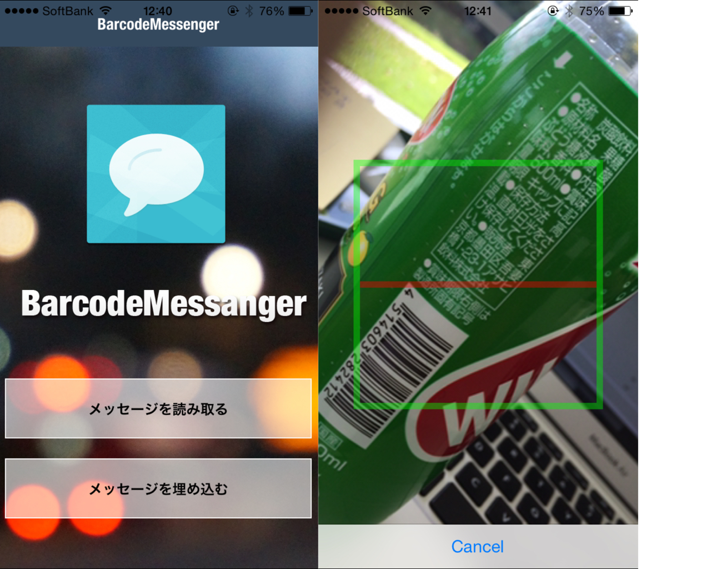

# Barcode Messenger for iOS/Android

by [@Hikaru_Itou](http://www.twitter.com/Hikaru_Itou)
* Powered by Apache Cordova
* Powered by Backbone.js
* Powered by Handlebars.js


## 1. Description

バーコードに擬似的にメッセージを埋め込むことができるアプリです。

'書き込む'機能で、テキストを入力し、バーコードをアプリのバーコードスキャナーで読み取るとバーコードに擬似的にメッセージを埋め込むことができます。

'読み取る'機能で、バーコードをアプリのバーコードスキャナーで読み取ると、埋め込んであるメッセージを読み出すことができます。


テキストデータはサーバーで同期され、アプリから読み取ることができます。


## 2. Screenshots and DemoVideo





[](http://www.youtube.com/watch?v=OYKsTNs980g)


## 3. Installation

基本的には普通のCordovaプロジェクトと同じ

### Install Cordova

```xml
$ sudo npm install -g cordova
```

### iOS

Open `platform/ios/BarcodeMessage.xcodeproj`.

Setting your Provisioning Profile.

Build Projects for your Device.

### Android

```xml
$ cordova prepare
$ cordova run android
```


